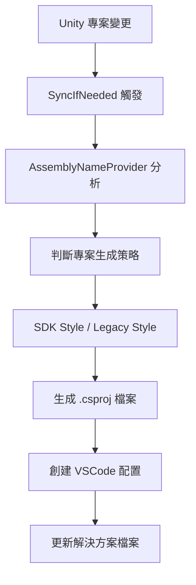

# Unity Cursor Editor Integration - 技術文件

## 概述

Unity Cursor Editor Integration 是一個專為 Unity 開發者設計的編輯器整合套件，提供完整的 Cursor 編輯器支援。本套件不建議由使用者直接修改，也不提供任何供使用者專案使用的公開 API。

## 架構概述

### 核心元件

#### 1. 編輯器整合層
- **`VisualStudioEditor`**: 主要的編輯器介面，實作 `IExternalCodeEditor`
- **`VisualStudioCursorInstallation`**: 處理 Cursor 編輯器的發現和配置
- **`Discovery`**: 統一的安裝發現服務

#### 2. 專案生成系統
- **`ProjectGeneration`**: 核心專案生成邏輯
- **`SdkStyleProjectGeneration`**: SDK 風格專案生成器
- **`LegacyStyleProjectGeneration`**: 傳統風格專案生成器
- **`AssemblyNameProvider`**: 組件名稱和專案生成標誌管理

#### 3. 平台適配層
- **Windows**: 透過 COM 整合和登錄檔查詢
- **macOS**: 使用 Apple Event 整合
- **Linux**: XDG 桌面檔案解析

### 專案生成流程



### 配置檔案管理

套件會自動管理以下配置檔案：

#### `.vscode/launch.json`
- Unity 除錯配置
- 編輯器附加設定
- 播放器附加設定

#### `.vscode/settings.json`
- 檔案排除規則
- 編輯器偏好設定
- Unity 特定設定

#### `.vscode/extensions.json`
- 推薦的 VSCode 擴充套件
- Unity 開發必需的擴充套件

## API 參考

### IVisualStudioInstallation

```csharp
public interface IVisualStudioInstallation
{
    string Name { get; }
    string Path { get; }
    Version Version { get; }
    bool IsPrerelease { get; }
    bool SupportsAnalyzers { get; }
    Version LatestLanguageVersionSupported { get; }
    IGenerator ProjectGenerator { get; }
    
    string[] GetAnalyzers();
    bool Open(string path, int line, int column, string solution);
    void CreateExtraFiles(string projectDirectory);
}
```

### ProjectGenerationFlag

控制為不同類型的套件生成專案檔案：

```csharp
[Flags]
public enum ProjectGenerationFlag
{
    None = 0,
    Embedded = 1,
    Local = 2,
    Registry = 4,
    Git = 8,
    BuiltIn = 16,
    LocalTarBall = 32,
    Unknown = 64,
    PlayerAssemblies = 128
}
```

## 擴展性

### 自訂專案生成器

實作 `IGenerator` 介面：

```csharp
public interface IGenerator
{
    bool SyncIfNeeded(IEnumerable<string> affectedFiles, IEnumerable<string> reimportedFiles);
    void Sync();
    bool HasSolutionBeenGenerated();
    string SolutionFile();
    IAssemblyNameProvider AssemblyNameProvider { get; }
}
```

### 新增編輯器支援

1. 實作 `IVisualStudioInstallation`
2. 在 `Discovery.cs` 中註冊新的發現邏輯
3. 實作平台特定的檔案路徑解析

## 除錯與故障排除

### 常見問題

#### 1. 專案檔案未生成
- 檢查專案生成標誌設定
- 確認 Unity 版本相容性
- 查看 Unity Console 中的錯誤訊息

#### 2. Cursor 無法開啟檔案
- 驗證 Cursor 安裝路徑
- 檢查檔案關聯設定
- 確認權限設定

#### 3. IntelliSense 無法正常工作
- 重新生成專案檔案
- 檢查 .csproj 檔案內容
- 確認相關 VSCode 擴充套件已安裝

### 日誌與診斷

套件使用 Unity 的日誌系統：

```csharp
Debug.Log($"Cursor installation found: {installation.Name}");
Debug.LogError($"Error detecting installations: {ex}");
Debug.LogWarning($"Legacy pdb format detected: {file}");
```

## 開發指南

### 本地開發設定

1. Clone 專案到本地
2. 在 Unity 中作為 local package 載入
3. 使用 Unity Test Runner 執行測試

### 測試

套件包含單元測試和整合測試：

```csharp
// 測試編輯器發現
[Test]
public void TestCursorInstallationDiscovery()
{
    // 測試邏輯
}

// 測試專案生成
[Test]
public void TestProjectGeneration()
{
    // 測試邏輯
}
```

### 效能考量

- 使用異步操作進行安裝發現
- 快取已發現的安裝資訊
- 最小化檔案 I/O 操作

## 相容性

### Unity 版本
- 最低支援：Unity 2019.4.25f1
- 測試版本：2019.4 LTS, 2020.3 LTS, 2021.3 LTS, 2022.3 LTS

### Cursor 版本
- 支援所有 Cursor 版本
- 自動檢測 Insider 版本
- 相容 VSCode 擴充套件生態系統

### 作業系統
- Windows 10/11
- macOS 10.15+
- Ubuntu 18.04+

## 授權

本專案遵循 MIT 授權條款。詳細資訊請參閱 LICENSE.md 檔案。